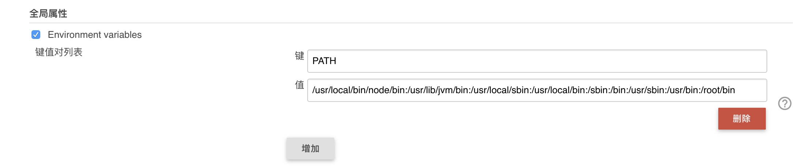
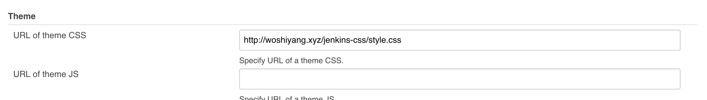
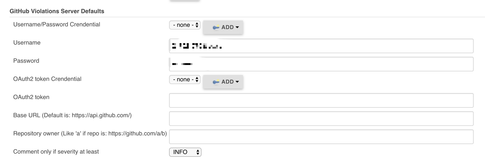
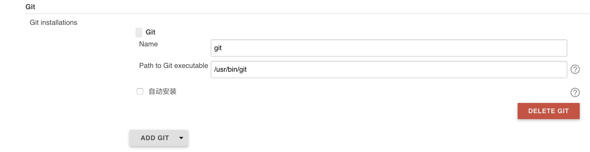
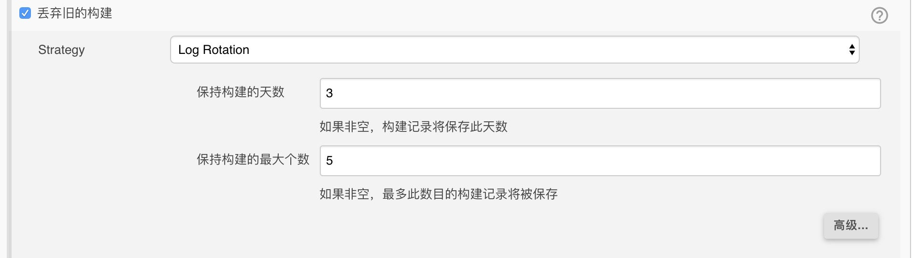
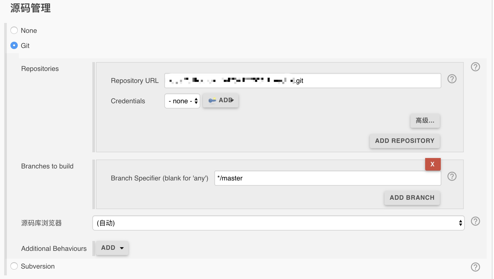

# docker使用

<span style="color:red;">该`docker`使用环境为：`centos`</span>
<ol>
	<li><a href="#1">安装docker条件</a></li>
	<li><a href="#2">检查条件</a></li>
	<li><a href="#3">安装docker</a></li>
	<li><a href="#4">docker使用</a></li>
	<li><a href="#5">使用docker搭建nodejs项目</a></li>
	<li><a href="#6">搭建jenkins服务</a></li>
</ol>

## 安装docker条件<a name="1"></a>

使用`docker`条件  

-  必须是64位CPU架构的计算机，Docker目前不支持32位CPU
-  运行Linux3.8或更高版本内核，CentOS时内核必不小于3.10
-  内核必须支持一种合适的存储驱动，可以是Device Manager、AUFS、vfs、btrfs、以及默认的驱动Device Mapper中的一个
-  内核必须支持并开启cgroup和命名空间namespace功能

## 检查条件<a name="2"></a>

-  内核

```
> uname -a
```
```
Linux VM_120_89_centos 3.10.0-327.36.3.el7.x86_64 #1 SMP Mon Oct 24 16:09:20 UTC 2016 x86_64 x86_64 x86_64 GNU/Linux
```
-  检查`Device Mapper`

```
> ls -l /sys/class/misc/device-mapper
或者在/proc/device文件中检查是否有device-mapper条目
> grep device-mapper /proc/devices
```
如果均没成功，可以用`yum`下载包：`device-mapper`、`device-mapper-multipath`

## 安装docker

```
> yum -y install docker.io
```

## docker的使用<a name="4"></a>

`docker`的镜像容器存储位置在: `/var/lib/dokcer`

查看`docker`信息

```
> docker info
```

`docker`状态

```
> systemctl status docker
```

停止`docker`服务

```
> systemctl stop docker
```

下载一个镜像

```
> docker pull centos:latest
```

启动`docker`

```
> service docker start
```

开机启动

```
> chkconfig docker on
```

查看已下载镜像

```
> docker images
```

删除镜像

```
> docker rmi $IMAGE_ID
```

如果删除镜像提示  
`Error response from daemon: conflict: unable to delete 9f38484d220f (must be forced) - image is referenced in multiple repositories`  
说明有两个镜像id相同，需执行命令`docker rmi -f $IMAGE_ID`

运行一个容器

```
> docker run -i -t centos /bin/bash
```

容器启动到删除

```
启动一个容器
> docker start $CONTAINER_ID
进入一个容器
> docker attach $CONTAINER_ID
重启
> docker restart $CONTAINER_ID
停止
> docker stop $CONTAINER_ID
删除一个容器
> docker rm $CONTAINER_ID
退出容器并停止容器
ctrl + d
退出容器并不停止容器
ctrl + p + q
```

查看所有容器

```
> docker ps -a
查看启动镜像
> docker ps
```

查看容器日志

```
> docker logs $CONTAINER_ID
```

将机器`a`镜像迁移到另一台机器上  
机器`a`上的操作

```
> docker save $CONTAINER_ID > /xxx/xxx.tar
```

机器`b`上的操作

```
> docker load < /xxx/xxx.tar
```

[官网文档](https://docs.docker.com/get-started/#containers-vs-virtual-machines)  
[其他docker教程](http://www.linuxidc.com/Linux/2014-12/110947.htms)

## 使用docker搭建nodejs项目<a name="5"></a>

<span style="color:red;">本地mac使用docker，使用镜像为centos</span>

### 下载镜像

`docker pull centos:latest`

### 下载`nodejs`

如没有`yum`命令，可通过`wget`、`curl`命令下载  
下载成功如没有`make`命令，可通过  

```
make是gcc的编译器
yum -y install gcc automake autoconf libtool make
yum install gcc gcc-c++
下载编译好的nodejs
wget http://nodejs.org/dist/v7.6.0/node-v7.6.0.tar.xz
解压
tar -xf node-v7.6.0-linux-x64.tar
创建文件连接
ln -s /root/node-v7.6.0/bin/node /usr/local/bin/node 
ln -s /root/node-v7.6.0/bin/npm /usr/local/bin/npm
```

## 搭建jenkins服务<a name="6"></a>

<span style="color:red">安装必备</span>

-  `jdk`
-  `tomcat`

### 安装`jdk` 

```
> yum install java-1.6.0-openjdk

验证生效结果
> java -version
```

<span style="color:red">**错误：**</span>

1.

```
gzip: stdin: not in gzip format
tar: Child returned status 1
tar: Error is not recoverable: exiting now
```

使用命令`file [file]`，查看一下该文件是什么格式，

```
> file jdk-7u79-linux-x64.tar.gz

jdk-7u79-linux-x64.tar.gz: HTML document, ASCII text, with very long lines, with CRLF line terminators
```

文件格式为`HTML`，所以不能使用`tar`解压。  
该错误信息可以参考[该文章](http://www.cnblogs.com/yajing-zh/p/4952940.html)

### 安装`tomcat`

下载`tomcat`，[下载网址](https://tomcat.apache.org/download-90.cgi)

进入目录解压 

`> tar -zxvf [file]`

运行`tomcat`

```
> ./tomcat/bin/startup.sh

Using CATALINA_BASE:   /yang/download/tomat
Using CATALINA_HOME:   /yang/download/tomat
Using CATALINA_TMPDIR: /yang/download/tomat/temp
Using JRE_HOME:        /yang/download/jdk-9.0.1/jre
Using CLASSPATH:       /yang/download/tomat/bin/bootstrap.jar:/yang/download/tomat/bin/tomcat-juli.jar

启动成功
```

### 下载`jenkins`

安装`Jenkins－Stable`源

```
curl http://pkg.jenkins-ci.org/redhat-stable/jenkins.repo --output /etc/yum.repos.d/jenkins.repo
rpm --import https://jenkins-ci.org/redhat/jenkins-ci.org.key
yum clean all
```

安装`Jenkins－Stable`

`> yum -y install jenkins`

启动`Jenkins`

`> service jenkins start`

设置开机启动  

`> chkconfig jenkins on`

`jenkins`配置文件目录：`/etc/sysconfig/jenkins`

端口配置为`8088`, 用户配置为`root`，执行脚本需要root权限。

#### 系统管理 -> 系统设置  

环境变量设置


主题设置


git设置


#### 系统管理 -> `Configure Global Security`  

授权策略启动安全矩阵，并给相应账号权限。

#### 系统管理 -> `Global Tool Configuration`

git设置


#### 新建`item`

填写项目名称 -> 选择构建一个自由风格的软件项目

#### 配置`item`

`General`


点击 高级 显示名称可填写项目中文名称

源码管理


构建


<span style="color:red">**错误：**</span>

1、

```
Starting jenkins (via systemctl): Job for jenkins.service failed. 
See 'systemctl status jenkins.service' and 'journalctl -xn' for details. 
[FAILED]
```

出现此问题，很有可能是因为java未被安装，或者安装的java版本不正确, java -version查看java版本，如果出现类似于如下：   
java -version   
java version “1.5.0”   
gij (GNU libgcj) version 4.4.6 20110731 (Red Hat 4.4.6-3)   
说明你正在使用默认的GCJ，不能和jenkins兼容，那么需使用如下命令重新安装：  
卸载之前安装的java，然后重新安装。  
`yum -y install java-1.6.0-openjdk`

2、 访问不到查看是否防火墙禁止访问

```
查看防火墙状态
> firewall-cmd --state

如果防火墙开启
firewall-cmd --zone=public --add-port=8080/tcp --permanent
firewall-cmd --zone=public --add-service=http --permanent
firewall-cmd --reload
```

3、 报错`java.nio.file.InvalidPathException: Malformed input or input contains unmappable characters`

`jenkins`系统设置 -> 配置节点 -> `Environment variables`配置 -> `file.encoding UTF-8` -> 重启`jenkins`

4、 报错`error: cannot open .git/GETCH_HEAD: Permission denied`  

无权限，`jenkins`账号使用账号为`jenkins`用户，用户改为`root`用户  
配置文件 `/etc/sysconfig/jenkins`中`JENKINS_USER`改为`root`
