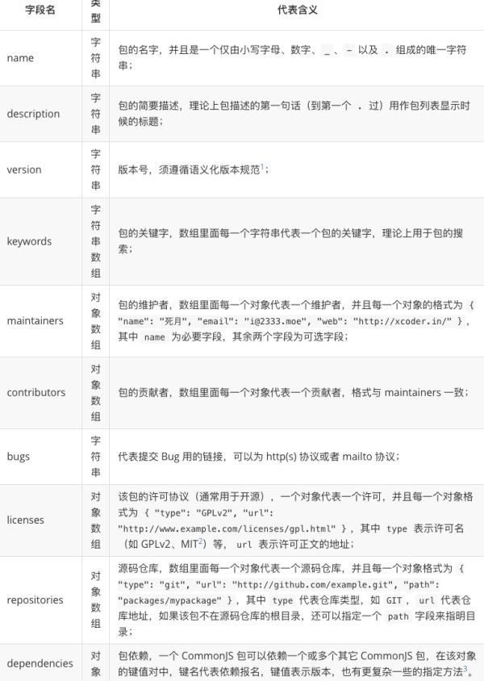
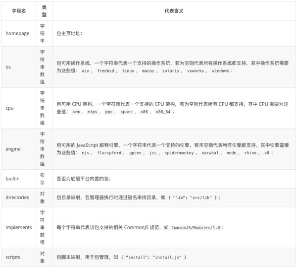
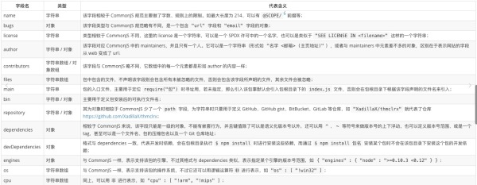
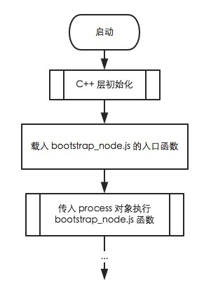
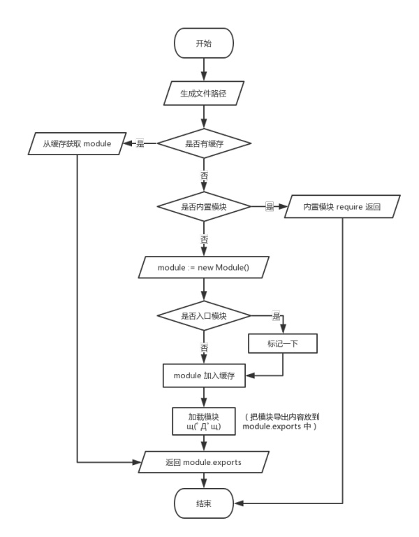
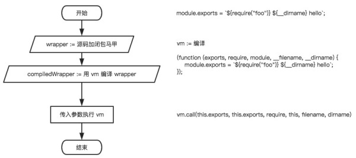

#nodejs包与模块机制

##问题

-  `AMD`、`CMD`的含义以及意义

##commonjs规范

-  三个约定 `require`、模块上下文、模块标志

###require

`require`本身就是一个函数，有一个参数，该参数就是该模块的模块标识，所引用的就是该模块暴露出来的接口。

###模块上下文

满足以下条件，即为模块上下文

-  模块函数
-  `exports`对象
-  `module`对象

`module`对象包含着`exports`对象，实际上`exports`对象和`module.exports`都是指向`exports`对象，最终暴露出去的接口都是`module.exports`对象，如果`exports`与`module.exports`优先暴露的是`module.exports`，并覆盖`exports`对象；
`module.exports === exports`。

###模块标志

<pre><code>Module Identifiers
A module identifier is a String of "terms" delimited by forward slashes.
A term must be a camelCase identifier, ".", or "..".
Module identifiers may not have file-name extensions like ".js".
Module identifiers may be "relative" or "top-level". A module identifier is "relative" if the first term is "." or "..".
Top-level identifiers are resolved off the conceptual module name space root.
Relative identifiers are resolved relative to the identifier of the module in which "require" is written and called</code></pre>

###未指明的约定

-  存储方案
-  加载器可以支持环境变量寻径，也可以不支持

####加载器

实际上最后加载器是通过`require`来表现的。

##Nodejs核心模块

-  文件模块
-  三方模块
-  项目模块

###三方模块

其它的标识不是以`"/"`、`"./"`或者`"../"`带头的模块被称为三方模块，这些模块通常以 Node.js 依赖包形式存在

在引入三方模块的时候，会先寻找一个合法的`package.json`文件，解析并寻找其中的`main`字段。

`node_module/test`模块有`package.json`、`biu.js`、`index.js`
<pre><code>//a,js
const Biu = require('biu')</code></pre>
<pre><code>// package.json 的部分源码
{
  ...,
  "main": "biu.js",
  ...
}</code></pre>
引入三方模块时，主要是看main指向的哪个文件。

1. 当前文件目录的`node_modules`目录下；
2. 若 1 没有符合的模块，则去当前文件目录的父目录的`node_modules`下；
3. 若没有符合的模块，则再往上一层目录的`node_modules`；
4. 若没有符合的模块，重复 3 直到寻找到符合的模块或者根目录为止。

三方模块如何快速引入该模块中的其他文件。

<pre><code>//express为例
const Resp = require("express/lib/response");</code></pre>

###项目模块

通常引入项目时，以`/`、`./`、`../`;

##模块缓存

其实模块在第一次`require`之后，就会把该模块放在缓存中，以后的`require`会从缓存中获取。  

模块缓存是根据目录来进行缓存的，只要目录相同则不会加载第二次。

一个包的缓存，必然会包含一个包的描述文件(`package.json`)。

###CommonJS中的package

必填字段

选填字段

保留字段  
在使用中尽量避免使用
<pre><code>build，default，email，external，files，
imports，maintainer，paths，platform，require，summary，
test，using，downloads，uid，type</code></pre>

一个遵循`CommonJS`规范的包会有如下一个目录呈现：  
  
`package.json`在根目录；  
二进制文件应当在`bin`目录下；  
`JavaScript`源码应当在`lib`目录下；  
文档应当在`docs`目录下；  
单元测试文件应当在`test`目录下；

###包和模块的关系

模块就是单个文件，包就是一系列的模块和资源文件的封装。

###npm中的package

##nodejs

###nodejs入口启动路程

###模块加载流程图

###C++加载流程图

